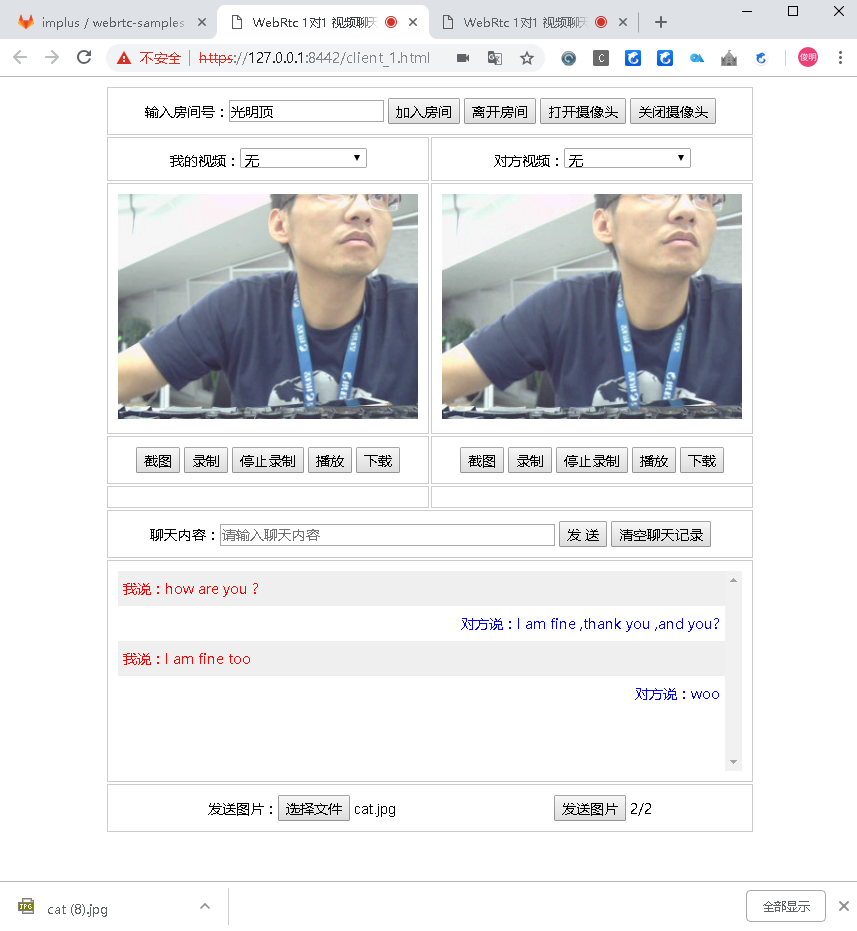

# webrtc-samples

### 启动方法
1. node app.js 启用服务端(需要本机有nodejs环境）
2. 浏览https://127.0.0.1:8442/client_1.html  注:建议最新版chrome
3. 点击"打开摄像头"
4. 房间号输入栏，输入房间号，比如abc
5. 然后再开一个浏览器tab页，仍然浏览该url
6. 同样的操作，打开摄像头，然后输入相同的房间号，顺利的话，二个页面上，自己视频和对方视频区，都能正常播放

